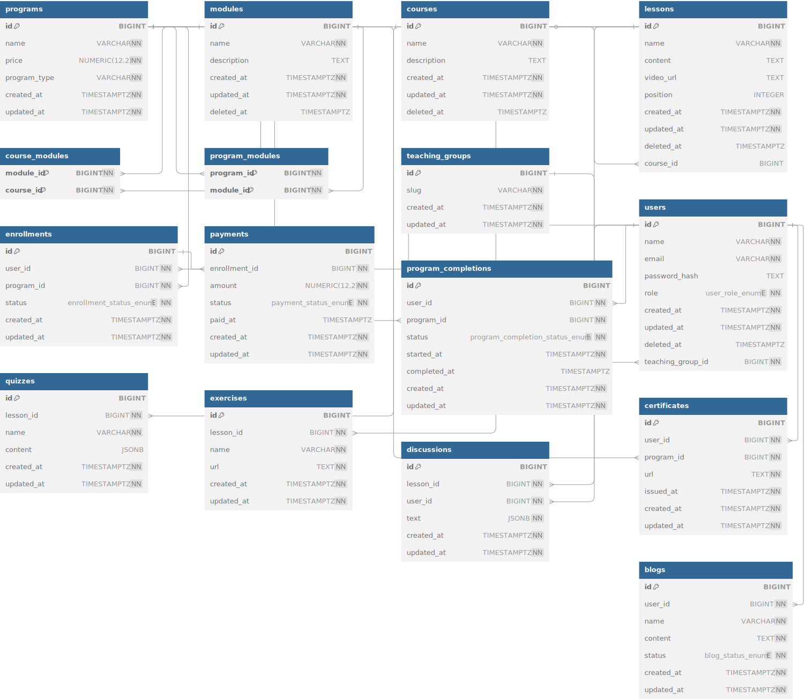

# Проект базы данных для образовательной платформы

##### Hexlet tests and linter status:

## Модель предметной области

#### 1. Платформа (программы, модули, курсы и уроки)

* Каждый урок принадлежит одному курсу.
* Каждый модуль состоит из нескольких курсов.
* В разных модулях курсы могут повторяться.
* Каждая программа обучения состоит из нескольких разных модулей.
* Модуль может использоваться в разных программах обучения.

#### 2. Пользователи и учебные группы.

* Каждый пользователь принадлежит одной группе.
* Роли: `Student`, `Teacher`, `Admin`.

#### 3. Взаимодействие пользователей с платформой

* **Подписка (`enrollments`)**
    * Уникальна по `(user_id, program_id)`.
    * Имеет `status`: `pending`, `active`, `cancelled`, `completed`.
* **Оплата (`payments`)**
    * Связан с подпиской 1-к-1.
    * Статус: `pending`, `paid`, `failed`, `refunded`.
* **Прогресс (`program_completions`)**
    * Отражает текущее состояние программы у пользователя.
    * При завершении выдаётся сертификат.

#### 4. Дополнительный контент

* После каждого урока пользователю предлагается пройти тест.
* После теста также предлагается пройти практическое задание.

#### 5. Социальный интерактив для пользователей

* Пользователи могут оставлять комментарии в ветке обсуждений после каждого урока.
* Пользователи могут писать статьи и вести личный блог обучения.

### [ER- diagram on dbdiagram.io](https://dbdiagram.io/d/6853168df039ec6d36dbbd14)

